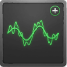

# Curve Noise Generator

A dockable Maya animation curve tool for adding noise, easing, scaling, and baking keyframes — all from interactive sliders that preview changes in real time.

Built for animators who need fast, non-destructive curve adjustments without leaving the Graph Editor.



## Features

**Bake** — Re-key animation on 1's, 2's, 3's, or 4's across the selected range. Interior baked keys are marked as breakdowns with special tick draws so they're easy to identify.

**Noise** — Add zigzag or random noise to selected keys. Drag the slider to the right for a strict alternating +/- zigzag pattern, or to the left for a random noise pattern with varying amplitudes. An optional taper checkbox diminishes the noise across the selection.

**Noise Build** — Gradually growing noise designed for flat or static curves. The first and last selected keys stay pinned at their original values while noise builds up toward the middle following a sine envelope. Positive for zigzag, negative for random.

**Scale** — Amplify or compress selected key values relative to a baseline interpolated between the first and last selected keys. Edges stay pinned. An optional "Scale both sides" checkbox shapes the effect with a bell envelope so it tapers at both ends.

**Ease** — Pull selected keys toward a neighboring unselected key using a power-curve envelope. Positive eases out toward the next key after the selection; negative eases in toward the previous key before the selection.

**Ease Both** — Combined ease-in and ease-out. Negative settles/dampens both ends toward their respective neighbor keys. Positive amplifies/overshoots by pushing values away from the interpolated baseline.

**Channel Filter** — TX, TY, TZ, RX, RY, RZ checkboxes restrict which curves are affected. When none are checked, all curves are included.

All sliders snap back to centre on release and the key cache is cleared after each operation, so every drag starts fresh from the current curve state. Full undo support is built in — each slider drag is a single undo chunk.

## Requirements

- Autodesk Maya 2020 or later

## Install

### Drag-and-Drop (recommended)

1. Place all three files in the same folder:

```
install_noise_generator.mel
noise_generator_1_0_0.py
noise_generator_icon.png
```

2. Drag `install_noise_generator.mel` into the Maya viewport.

The installer will:
- Copy the script to your Maya user scripts directory as `curve_noise_generator.py`
- Copy the icon to your Maya user prefs icons directory
- Add a shelf button labeled **CNG** to the currently active shelf

### Manual Install

1. Copy `noise_generator_1_0_0.py` to your Maya scripts directory and rename it to `curve_noise_generator.py`:

| OS | Path |
|---|---|
| Windows | `C:\Users\<you>\Documents\maya\scripts\` |
| macOS | `~/Library/Preferences/Autodesk/maya/scripts/` |
| Linux | `~/maya/scripts/` |

2. Copy `noise_generator_icon.png` to your Maya prefs icons directory:

| OS | Path |
|---|---|
| Windows | `C:\Users\<you>\Documents\maya\prefs\icons\` |
| macOS | `~/Library/Preferences/Autodesk/maya/prefs/icons/` |
| Linux | `~/maya/prefs/icons/` |

3. Create a shelf button manually, or run this in Maya's Script Editor:

```python
import curve_noise_generator
curve_noise_generator.launch()
```

## Usage

1. Select keys in the Graph Editor (or select objects and highlight a timeline range).
2. Click the **CNG** shelf button to open the tool.
3. Drag any slider to preview changes in real time. Release to commit.
4. Use **Ctrl+Z** to undo at any time.

## Files

| File | Description |
|---|---|
| `install_noise_generator.mel` | Drag-and-drop installer for Maya |
| `noise_generator_1_0_0.py` | Main script (v1.0.0) |
| `noise_generator_icon.png` | Shelf icon |

## License

Free to use and modify.
